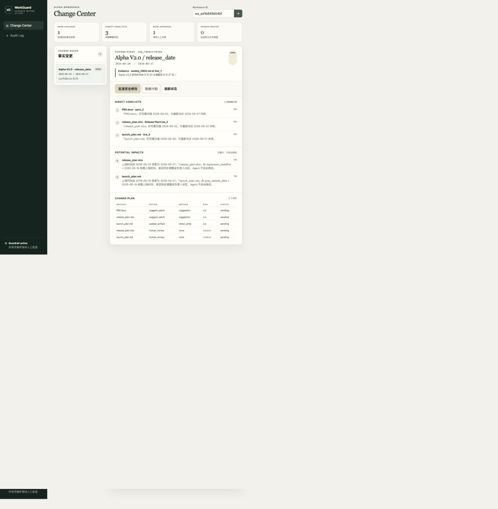

# WorkGuard

**面向团队办公场景的可验证跨文档事实一致性与变更影响 Agent**（初版实现）

> When one decision changes, WorkGuard finds everything else that should change with it.



周会决定「Alpha V2.0 发布时间由 9 月 20 日调整至 9 月 27 日」，但 PRD、Excel 排期、上线计划里还写着 09-20 —— WorkGuard 把文档抽成带来源的结构化 Fact，用 LangGraph 驱动 **Detect → Verify → Plan → Human Approval → Act → Verify → Rollback** 状态机，自动发现冲突、给出修改计划，人工批准后执行并全程留痕。

本仓库是按《WorkGuard.md》方案书实现的**初版（MVP）**，严格只做了方案书建议的第一条链路：

```
会议纪要修改上线日期 → 自动发现 PRD/XLSX/MD 冲突 → 人工批准 → 自动修改 → 校验 → 回滚
```

负责人 / 状态 / 版本等链路刻意未实现（见 [MVP 范围](#-mvp-范围与刻意不做的事)）。

---

## Demo

```bash
.venv/bin/python scripts/make_demo_files.py   # 生成 demo 用 DOCX/XLSX
.venv/bin/python scripts/run_demo.py          # 端到端：改期 → 冲突 → 审批 → 回写 → 回滚
```

无需任何 API Key（离线启发式抽取模式）。完整输出见 [下方示例](#demo-输出摘录)。

## Quick Start（API 服务）

```bash
uv venv .venv --python 3.12
uv sync --locked --extra dev
uvicorn backend.main:app --reload              # UI: http://127.0.0.1:8000/  API: /docs
```

也可以使用容器一键启动 API + 持久任务 Worker + PostgreSQL（Compose 使用 pgvector 镜像，为后续语义检索预留升级路径）：

```bash
docker compose up --build
# UI: http://127.0.0.1:8000/app/  Health: /health
```

镜像以非 root 用户运行、只绑定宿主机回环地址并内置健康检查；业务文件放入持久卷，PostgreSQL 模式的 LangGraph checkpoint 写入数据库。`.env` 不会进入构建上下文。`uv.lock` 与导出的 requirements lock 保证本地、CI 和镜像依赖可复现。GitHub Actions 会在每次 push/PR 上执行 Ruff、mypy、带覆盖率门槛的完整 pytest、PostgreSQL 集成测试，以及 API + Worker + PostgreSQL 的 Compose 冒烟链路。共享部署必须设置 `WORKGUARD_API_KEY`，并通过 `X-API-Key` 或 Bearer header 调用 API；默认 CORS 只允许本机来源。

共享给多个使用者时可再启用 `WORKGUARD_WORKSPACE_AUTH=1`。创建 workspace 会一次性返回签名 `workspace_key`，后续通过 `X-Workspace-Key` 发送；服务会对 workspace 路由以及 artifact/change/run/entity 等间接资源做归属校验。签名密钥使用 `WORKGUARD_WORKSPACE_TOKEN_SECRET`，未单独设置时回退到部署级 API Key。Web UI 顶部提供两种 Key 的内存输入框，不持久化到浏览器存储。

```bash
# 1. 建工作区（预置实体词典：解决 Entity Resolution 冷启动）
curl -X POST localhost:8000/api/workspaces -H 'Content-Type: application/json' -d '{
  "name": "Alpha Workspace",
  "preset_entities": [{"canonical_name": "Alpha V2.0", "aliases": ["Alpha", "V2.0"]}]}'

# 2. 上传文档（?sync=true 同步跑完图；默认写入持久任务队列并返回 job_id）
curl -X POST "localhost:8000/api/workspaces/$WS/artifacts?sync=true" -F file=@PRD.docx
curl -X POST "localhost:8000/api/workspaces/$WS/artifacts?sync=true" -F file=@weekly_0905.md
# → 返回 thread_id；GET /api/runs/{thread_id} 可见 waiting_approval=true

# 3. 查看变更与修改计划（冲突/影响/建议补丁/来源引用）
curl localhost:8000/api/changes/$CHANGE_ID

# 4. 人工批准 → 图从 interrupt 处恢复，执行 + 校验
curl -X POST localhost:8000/api/changes/$CHANGE_ID/approve \
  -H 'Content-Type: application/json' -d '{"decisions": {"all": "approve"}}'
# 或逐条：{"decisions": {"<action_id>": "reject", ...}}

# 5. 回滚 / 审计 / 问答
curl -X POST localhost:8000/api/changes/$CHANGE_ID/rollback
curl localhost:8000/api/workspaces/$WS/audit
curl -X POST localhost:8000/api/workspaces/$WS/chat -H 'Content-Type: application/json' \
  -d '{"question": "Alpha V2.0 现在什么时候上线？"}'
```

完整接口列表见 `backend/api/routes.py` 或打开 `/docs`。

---

## Architecture

```
                 ┌────────────────────────────────────────────────────┐
                 │                LangGraph Workflow                  │
                 │                                                    │
 upload ────► load_artifact → extract_facts → reflect_facts(自查) ──┐ │
                 │   → resolve_entities(词典/别名/消歧) → store_facts │ │
                 │   → detect_changes ──(无变化)──────────────────────┼─┤→ finalize
                 │        │(有变化)                                   │ │
                 │        ▼                                           │ │
                 │   retrieve_candidates(事实库+值扫描+BM25)          │ │
                 │        ▼                                           │ │
                 │   verify_conflicts(规则优先, LLM 复核)             │ │
                 │        ▼                                           │ │
                 │   analyze_impacts(模板/手动依赖, 不自动改)          │ │
                 │        ▼                                           │ │
                 │   generate_plan + risk_check                       │ │
                 │        ▼                                           │ │
                 │   request_approval ◄── interrupt() 挂起等人工      │ │
                 │        ├─ rejected ────────────────────────────────┼─┤→ finalize
                 │        └─ approved → execute_actions → post_verify─┘ │
                 └───────────────────┬────────────────────────────────┘
                                     ▼
        Tools: fact_store / markdown直写 / docx·xlsx受控回写 / 建议补丁 / rollback / audit
                                     ▼
        SQLite(默认, SQLAlchemy) —— PostgreSQL+pgvector 为后续迁移预留
```

### 目录结构

```
backend/
├── agents/            # Extractor(+Reflection) / Resolver / Retriever / Verifier / Impact / Planner
├── graph/             # LangGraph 状态与工作流（interrupt 审批、SqliteSaver 检查点）
├── tools/             # fact_store / document_tools(回写+补丁+快照) / audit
├── parsers/           # Markdown / DOCX / XLSX → 带 location 的结构化块
├── llm/               # OpenAI 兼容客户端 + 离线启发式抽取（无 Key 可跑）
├── services/          # ingest / changes(审批+回滚) / entities(消歧) / chat
├── api/  + main.py    # FastAPI
demo/workspace_alpha/  # 演示数据集（方案书 §52 的日期链路版）
eval/                  # OfficeConsistencyBench 日期子集 + 评估器 + 报告
frontend/              # 原生 Web Change Center（零额外前端依赖）+ 演示 GIF
tests/                 # pytest（日期链路、写回安全、回滚与 API 回归）
scripts/               # make_demo_files.py / run_demo.py
```

---

## 四个关键设计决策（对应方案书的"深水区"）

### 1. 抽取准确性：Reflection 自查 + Unverified 隔离

- **extract_facts → reflect_facts 两段式**：Reflection 节点把每条 Fact 与原文对照——evidence 引文必须在原文中找到（防幻觉硬校验）、日期必须真实可解析、口语化模糊表述（"可能/暂定"）强制降置信度。
- **Unverified 隔离**：置信度低于 `0.6`（可配）的 Fact 存库但标记 `unverified`，**绝不参与冲突检测**，只在 Workspace 里作为参考展示。
- LLM 模式额外多一道 LLM 自审（`supported=false` 直接丢弃），再过同样的确定性校验。

### 2. 写回安全：Markdown 直写，DOCX/XLSX 默认只出"建议补丁"

| 格式 | 行为 | 原因 |
| --- | --- | --- |
| Markdown / TXT | 直接回写（按行定位、要求目标范围内唯一命中、保留 UTF-8 BOM/CRLF/末尾换行及原日期风格） | 歧义或非 UTF-8 编码时整批拒绝，不做部分修改或静默转码 |
| DOCX / XLSX | **默认不碰原文件**，按动作生成唯一的 `<原文件名>.workguard-<action>.patch.md`：精确定位 + 原文/修改后对照 | python-docx 跨 run 改写会破坏段内样式；openpyxl 会丢图表/宏；唯一文件名避免连续改期互相覆盖 |
| DOCX/XLSX（可选） | `WORKGUARD_OFFICE_WRITE=1` 开启受控回写：仅替换单个 run 内完整匹配的文本 / 仅改非公式单元格，跨 run 匹配**直接拒绝**并降级为建议 | 把样式/公式破坏风险挡在门外 |

每次成功修改都会追加一个不可变 `artifact_version`；版本号只递增，回滚也以新版本记录恢复后的内容，不覆盖历史。审批计划保存目标版本和文件哈希，审批前若文件被人改过会拒绝执行并要求重新检测，旧回滚也不能覆盖后续已批准版本。只有 Post Verify 回读通过后，目标文档的新日期才同步进 Fact Store，因此连续改期会使用最新版本事实。建议补丁同样要求唯一定位；回滚会删除本次生成的补丁。**XLSX 的公式单元格永远不会被覆盖为静态值**（有专门测试）。

### P0 故障一致性

- 每个获批动作先备份原始文件字节，再执行文件写入、版本入库、状态和审计的单动作事务；保存、解析或数据库提交任一步失败都会恢复原文件并清理本次补丁。
- 多文件回滚先完成版本、文件和补丁路径预检，再整批执行；任一文件或最终提交失败时恢复全部回滚前字节，事件进入可重试的 `rollback_failed`。
- 回滚接口幂等：已回滚事件再次调用直接返回成功状态；补丁已被人工删除不会阻塞回滚。
- 部分审批采用 fail-closed 语义：提交逐动作选择而没有 `all` 时，未列出的动作视为拒绝，事件标记 `partially_executed`，只校验及回滚实际执行的动作。
- HTTP 层覆盖创建、上传、检测、查询、审批、拒绝、部分审批、重复请求、回滚及非法决策校验。

### P1 日期与业务边界

- **日期抽取边界**：覆盖闰年/月末、跨月/跨年、同段多实体、仅月日但文档年份不同等情况；日期区间不会被猜成单个上线日，而是降级为 `unverified`。同一段出现更具体的灰度/公告日期时，不再由“发布”子串额外制造 `release_date`。
- **Office 输入与受控回写边界**：上传拒绝空文件、超限文件、损坏/伪造/加密 Office 包、ZIP 条目过多和解压体积超限；DOCX 表格单元格可在受控模式下定位修改；XLSX 覆盖日期类型单元格、隐藏工作表和合并单元格，保留公式并要求 Excel 打开时重算。工作表或行不存在时整批拒绝，文件字节不变。
- **来源权威等级**：按方案书 §18 落地固定层级：Decision Record 100、Meeting 90、Project Management 85、PRD 80、Excel Plan 75、Weekly Report 60、Chat 40、Historical 30。已有 Current Truth 只能被带明确决策信号、旧值前置条件一致且来源等级不低的新事实推进；等级和证据会通过 Fact/Change API 展示。
- **消歧历史重放**：同一未决 mention 再次出现仍留在隔离通道，不会因“精确匹配 pending 实体”而提前验证。人工合并后，多条历史 Fact 按摄取顺序逐条重放，并复用同一套来源等级与旧值检查，保证每个 `(entity, predicate)` 最多一个 current。
- **审批竞态与拒绝语义**：批准/拒绝使用数据库条件更新抢占 `pending_approval`，并发请求只能有一个胜者、只恢复一次 LangGraph。拒绝表示“不把这次变化传播到其他文档”，不会否定已由权威来源建立的新事实；如需撤销事实，应由后续决议或执行后的 Rollback 完成。

### P2 降级、批次与可观测性

- **LLM 输出不可信边界**：模型返回错误类型、非法/NaN/越界置信度、未知 location 或全部否决时不会让流程崩溃；置信度统一限制在 `[0, 1]`，非法定位被确定性 Reflection 拦截，必要时回退启发式抽取。LLM 模式也会从原文确定性恢复 `change_from`，因此不能绕过旧值前置条件；Reflection 允许修正值，但不能凭空新增 predicate/location，且保留原实体与证据来源。
- **失败兜底隔离**：Hybrid 中只要 LLM 抽取为空、返回非法结构或 Reflection 无法保留候选，启发式兜底结果统一标记为 `heuristic_fallback + unverified`，保留给人工参考但不能推进 Current Truth、触发冲突或进入自动写回，避免兜底候选被误当成已验证事实。
- **多变更 Run 原子生命周期**：一份文档同时触发多个 ChangeEvent 时，审批范围明确为整个 LangGraph Run。服务会一次性 CAS 抢占同批事件；任一事件已被处理则整批拒绝，批准/拒绝各只恢复一次图。回滚同样以 Run 为范围，按每个文件最早的批次版本整体恢复，并对文件、补丁和数据库执行补偿。Change API 返回 `approval_scope.change_ids/change_count`，Web UI 会显示批次提示并二次确认。
- **同批次同文件连续写**：多个获批事件需要修改同一文件时，首个动作提交新版本后，只对同一已审批批次内的后续动作刷新版本/hash 守卫，使系统自己的 v1→v2 不会被误判为外部篡改；不同 Run 之间仍严格拒绝陈旧计划。
- **失败 Run 终态**：LangGraph 启动或实体消歧重处理抛出异常时，`AgentRun` 会进入 `failed`、记录结构化错误及结束时间，并通过正常结果 envelope 和 `/api/runs/{thread_id}` 查询，不再永久停留在 `running`。
- **问答只看当前文件版本**：Chat 的“仍有旧文档”统计会过滤不可变历史版本，仅把当前 `artifact_version` 中仍存在的旧事实计入，同时在引用中返回来源 Authority。

### 3. Entity Resolution 冷启动：预置词典 + 交互式消歧 + 别名学习

- 建工作区时可预置实体词典（canonical + aliases），Resolver 走 **Exact → Alias → Token Fuzzy → LLM** 四级瀑布，不把所有判断丢给 LLM；当前 Fuzzy 是 token/bigram Jaccard，不包装成神经向量 Embedding。
- 仍无法确定时**不猜**：实体标记 `pending_disambiguation`，相关 Fact 一律 unverified；通过 `POST /api/entities/{id}/resolve`（merge_to / keep_as_new）人工裁定**一次**，答案写回别名词典（few-shot learning），下次自动命中。

### 4. 隐式依赖：只用模板 + 手动关联，不让 LLM 因果推理

- 影响分析只基于显式规则：预置模板（`regression_deadline before release_date` 等）+ 用户手动添加的 `DependencyRule`。
- 所有影响项 `auto_update_allowed=False`，Agent 只提示"需要负责人重新确认"，绝不自动改依赖日期。LLM 自动发现隐式依赖属于 V2（方案书 §50）。

---

## Human-in-the-loop：LangGraph interrupt/resume

`request_approval` 节点调用 `interrupt()`，整次 run 在 `pending_approval` 状态 checkpoint；审批 API 用 `Command(resume=...)` 在**同一条 thread** 上恢复执行。SQLite 本地模式使用 `WORKGUARD_CHECKPOINT_PATH`；PostgreSQL 模式使用官方 `PostgresSaver` 及同一数据库中的 checkpoint tables，可跨容器重启并供共享实例访问。这也是本项目最核心的 LangGraph 演示点。

本地 SQLite 业务库和 checkpoint 默认写入被忽略的 `data/` 目录，项目根目录不会再生成大体积运行状态文件。

## 防幻觉：七层限制（方案书 §42 的落地）

Structured Output（JSON only）→ Schema/Pydantic 校验 → Source Citation（每个判断带 artifact+location+原文引文）→ Reflection 证据回查 → 规则优先（Verifier 规则先行，LLM 只复核）→ 双置信度阈值（Fact 0.6 / Conflict 0.7，低于阈值一律 Need Review）→ 人工审批（所有写操作必须批准，`human_review` 类永远跳过）。

## Evaluation（方法可复现，结果不随项目提交）

```bash
.venv/bin/python eval/evaluator.py
```

评测程序覆盖精选日期链路与 DOCX/XLSX/Markdown 混合格式执行基准，包括基础冲突、历史语义、来源顺序、旧值前置条件、实体区分、低置信度、谓词隔离、依赖影响、日期格式、非法/相对日期、跨月和跨年变更。

此外有 127 个 pytest 自动化用例，包含日期/Office/来源权威/实体重放/审批并发、API Key、workspace 越权与跨站请求边界、CORS capability header、持久 checkpoint 重建恢复、持久任务租约/续租/重试与所有权保护、LLM usage 重启恢复、审计脱敏、LLM 异常降级、多变更批次与失败 Run、飞书事件鉴权与幂等边界、真实导出协议与应用机器人消息契约、盲测防泄漏协议，以及数据库提交失败、文件写入中断、多文件及多事件回滚中途失败、缺失快照/源文件/建议补丁、补偿恢复与安全重试等故障注入场景。

评测会生成 Conflict P/R/F1、变更准确率、历史误报率、实体归因、影响召回、工具成功率、Unsafe Update Rate、延迟、Token 和成本等机器可读指标。所有生成物统一写入 `eval/reports/`；该目录被版本控制忽略，只作为作者本地验证证据，不属于公开项目交付。

**诚实说明**：这是小规模精选子集上的结果，证明的是当前链路表现，不代表开放场景下的泛化水平。已知失败模式：

1. **相对日期**（"往后挪到下周三"）不解析 → 宁可漏报不误报（C13 用例固化此行为）；
2. **口语化幅度表达**（"往后挪一周"）无法换算具体日期 → 产出 unverified 事实；
3. **同名实体**（Alpha App vs Alpha API）依赖词典/消歧兜底，纯模糊匹配会错链——这正是保留 `pending_disambiguation` 的原因。
4. **日期来源权威性**已采用固定 Authority 层级和保守门禁；当前层级由全局文件名/角色规则判定，尚未做工作区级自定义权重、组织级审批策略或外部系统身份签名；
5. **时间粒度**目前只到自然日，不处理时区、具体时刻、重复日程、节假日顺延及“本月底”等业务日历表达；
6. **同一定位出现多个旧日期**时系统会拒绝自动替换并标记人工定位，这是安全策略，不是自动猜测其中一个。

## Demo 输出摘录

```
Step 2  上传触发文档：weekly_0905.md（周会决议：发布时间 09-20 -> 09-27）
  New Change Detected: Alpha V2.0 / release_date
    2026-09-20  ->  2026-09-27   (confidence 0.92)
  Source: weekly_0905.md  "Alpha V2.0 发布时间由 9 月 20 日调整至 9 月 27 日。"
  LangGraph paused at: ['request_approval'] (waiting human approval)

Step 3  [明确冲突]
  ✗ PRD.docx @ para_2            "Alpha V2.0 将于 2026 年 9 月 20 日正式发布。"
  ✗ release_plan.xlsx @ row_2    "Release Date: 2026-09-20"
  ✗ launch_plan.md @ line_5      "Alpha V2.0 定于 9 月 20 日正式上线，"
  · weekly_0829.md               历史记录，不需要修改（Agent 不改会议纪要）
  [潜在影响]  regression_deadline / gray_release_date → 需负责人重新确认，Agent 不自动修改
  [修改计划]  launch_plan.md=direct_write(低风险)  PRD/XLSX=suggestion(建议补丁)

Step 4  人工批准 → 执行 → Post Verification: PASS / patch_generated
Step 5  before: …定于 9 月 20 日正式上线…   after: …定于 9 月 27 日正式上线…
Step 6  回滚 → 文件恢复 v1，Fact 真值翻回 09-20，全程审计
```

## MVP 范围与刻意不做的事

已做：Workspace / 上传解析(MD/TXT/DOCX/XLSX) / 日期 Fact 抽取 + Reflection / 实体消歧及确认后重处理 / 冲突检测 + Verifier / 模板依赖影响分析 / 修改计划 + 风险分级 / interrupt 审批 / MD 直写 + Office 建议补丁（+可选受控回写）/ 版本快照 / Post Verify 失败传播 / Audit / Rollback / Chat / Eval / Change Center Web UI（含上传、Fact 隔离视图、实体消歧、逐动作审批、Diff、失败 Run 重试与飞书绑定）。

刻意不做（防止项目失控）：负责人/状态/版本链路、MCP Server、LLM 隐式依赖推理、PDF、多用户权限。均为 V2/V3 计划。Web UI 使用与 FastAPI 同源部署的原生 HTML/CSS/JS，暂不引入 React 构建链。

### 前端闭环（`/app/`）

- **上传**：拖拽/选择多文件上传（MD/TXT/DOCX/XLSX），逐文件显示抽取与变更检测结果，可直接跳到变更卡片；也可在页面上创建工作区并预置实体词典。
- **实体消歧**：侧边栏实时显示待消歧数量；逐条裁定"合并到已知实体（学习别名）/保留为新实体"。
- **逐动作审批**：Change plan 表格内逐动作勾选，未勾选 = 拒绝（与后端 fail-closed 语义一致），也可一键全部批准/拒绝；同批多变更会提示批次作用范围。
- **Diff**：每个动作可展开前后对比（变更片段高亮），Office 建议补丁动作会注明"原文件不会被修改"。
- **Facts / Runs**：展示 evidence、来源权威等级和 Unverified 原因；失败 Run 可从原 artifact 创建新 thread 重试，旧 Run 保留用于审计。

### 飞书（Feishu/Lark）接入

`backend/integrations/feishu/`，无 SDK 依赖的 Open API 适配器，未配置凭据时优雅降级（`/api/integrations/feishu/status` 报 not_configured，sync 返回 503）：

- **云文档同步**：`POST /api/integrations/feishu/sync` 拉取指定文件夹下的 doc/docx（导出为 DOCX 后走既有解析→抽取→变更检测链路）与多维表格（记录展平为 Markdown 键值对，"Release Date: 2026-09-20" 直接可抽取）。
- **显式绑定**：`POST /api/integrations/feishu/bindings` 把 folder_token 绑定到指定 workspace；首次同步记录 remote file → artifact 映射，后续同内容跳过、变更内容追加 ArtifactVersion，不创建重复 Artifact。
- **事件订阅（Webhook）**：`POST /api/integrations/feishu/webhook` 必须通过 `FEISHU_VERIFICATION_TOKEN` 校验，按 event_id 持久化幂等并按 file_token 精确路由；先应答再通过后台任务同步。同步每个受支持文件时还会调用飞书逐文档订阅 API，并在响应的 `event_subscriptions` 中明确返回成功或错误；订阅失败不影响手动同步，但表示该文件尚未具备自动触发能力。当前明确拒绝加密事件，不能把 `FEISHU_ENCRYPT_KEY` 已配置误报为已支持。
- **审批通知**：检测到待审批变更时，优先通过已发布应用机器人的 `im/v1/messages` 推送到显式配置的 `chat_id/open_id`；未配置应用机器人接收者时可回退到自定义机器人 Webhook。两条路径都 best-effort，不阻塞主链路，也不会猜测接收者。

配置（见 `.env.example`）：`FEISHU_APP_ID` / `FEISHU_APP_SECRET` / `FEISHU_NOTIFY_RECEIVE_ID` / `FEISHU_NOTIFY_RECEIVE_ID_TYPE` / `FEISHU_WEBHOOK_URL` / `FEISHU_FOLDER_TOKEN` / `FEISHU_VERIFICATION_TOKEN`。`FEISHU_FOLDER_TOKEN=root` 表示应用自身 Drive 根目录，主要用于隔离 E2E；Compose 已通过独立的持久 Worker 处理同步事件，生产多租户部署还应将 capability token 升级为用户身份与 RBAC。

飞书应用使用应用身份（`tenant_access_token`），最小读取权限为 `drive:drive:readonly`、`docs:document:export` 与 `bitable:app:readonly`；应用机器人通知还需 `im:message`。目标文件夹或多维表格还需把应用添加为可访问成员。自动编辑事件还必须同时完成两层配置：在开放平台添加 `drive.file.edit_v1`，开通应用身份 `docs:event:subscribe`，并为应用身份和用户身份分别开通 `docs:event.document_edited:read`；WorkGuard 才能在首次同步时为每份文档建立订阅。事件回调要求可被飞书访问的公网 HTTPS 地址指向 `/api/integrations/feishu/webhook`；仅在本机运行时可使用手动同步，不应把 `127.0.0.1` 配成飞书回调地址。

飞书真实租户的验收证据保存在本地私有报告中，不随仓库提交。公开代码只声明可由接口、MockTransport 契约测试及使用者自己的租户复现的能力，不包含租户标识、远端文档、调用结果或私有验收记录。

## LLM 对比实验：噪声数据集 / 消融 / 错误分析

### 抽取级噪声基准（`eval/dataset/extraction_cases.jsonl`，46 例）

在端到端 28 例之外，建立 **Fact 级 ground truth** 的抽取基准，按噪声类型分组：clean / change（变更句）/ hedged（模糊）/ relative（相对日期）/ mixed（多谓词多实体）/ scope（范围外负例）/ typo（错别字）/ spacing（空格噪音）/ format（全角、斜杠、点分）/ english / crossyear（跨年歧义）。指标：Fact 级 P/R/F1、幻觉(verified)数、hedged 路由正确率、实体归属准确率、真实 token 用量与成本（`backend/llm/usage.py` 逐调用记录，价格表可经 `WORKGUARD_PRICE_IN/OUT_PER_1M` 覆盖）。

错误分析器会把失败案例按表层噪音、谓词误归属、条件句、英文格式、跨年推断和指代消解自动分桶。对应的防护包括：

1. **表层噪音（typo/spacing ×5）**：关键词匹配升级为空白容忍 + CJK 长关键词单字替换模糊匹配（"发部时间"→"发布时间"、"回规测试"→"回归测试"、"发 布 时 间" 均可命中）；
2. **谓词误归属 ×1**（"灰渡发布" 内层的 "发布" 抢走 gray 日期）：跨谓词关键词**重叠去重**——重叠时保留更长的匹配（等长保留更早者），"灰度发布日期" 不再产出 release_date；
3. **条件句误报 ×1**（"若回归 9 月 17 日未完成则顺延"）：hedging/条件标记（若/如果/届时…）改为**碎片级**判定，只影响自己所在的分句；
4. **英文格式 ×1**：`find_dates` 支持英文月份（"Sep 27, 2026" / "27 Sep 2026" / "May 3rd"），并加 "launch" 谓词关键词；
5. **跨年推断 ×1**：显式次年标记（次年/明年/来年/跨年）将年推断 +1，"上线 1 月 8 日，次年开年首播" → 2027-01-08；
6. **指代消解 ×1**（"那个时间大概在 9 月 28 日左右"）：文档级谓词语境继承，无本地关键词的指代日期按上文谓词落 Unverified 车道。

这些规则用于固定已知回归，例如变更句整块优先解析，避免把“原计划日期”误当成新事实。具体前后指标保留在本地报告，不写入公开文档。

另有 `eval/dataset/noisy_date_cases.json` 压力集，覆盖否定/取消、待确认、紧凑变更写法、发布会与上线日期并列、歧义美式日期等。它是针对已知错误的回归集合，不代表开放分布泛化结果。`eval/noisy_evaluator.py --require-llm` 会在没有真实模型时 fail closed，并对纯 LLM 的 before/after Reflection 分别测量，不允许启发式回退污染结果。

### 消融实验（`eval/ablation.py`）

脚本分别关闭 Verifier、来源权威门禁、旧值扫描、依赖模板、Reflection 和置信度闸门，测量各安全层对 Precision、Recall、历史误报和影响召回的边际贡献。消融数值属于本地评测产物，不随项目提交。

### 接真实 LLM 一键对比

```bash
export OPENAI_API_KEY=sk-...            # 或 DEEPSEEK/QWEN 兼容端点
export OPENAI_BASE_URL=https://dashscope.aliyuncs.com/compatible-mode/v1
export WORKGUARD_LLM_MODEL=qwen-plus
bash scripts/run_llm_compare.sh
```

脚本依次跑：启发式基准 → **纯 LLM**（禁用规则回退）→ **生产 Hybrid**（允许回退）→ LLM 模式端到端 eval。API 尝试和 retry 会分别计数，避免低估调用失败率与延迟；启发式模式显式禁用默认 LLM，必须保持 0 调用。输出全部进入被忽略的 `eval/reports/`。

### 开发期不可见的外部盲测

仓库内数据无法被诚实地称为“完全不可见”，因此新增 `eval/blind_evaluator.py` 和 `eval/blind/` 协议，但不提交盲测明文。独立评测人把至少 30 例数据保存在仓库外，代码冻结前只提供 SHA-256；执行器校验数据指纹、拒绝仓库内明文、记录 one-shot receipt，并只输出总体指标，不泄露案例 ID、文本、标签或逐例错误。详细交付流程见 `eval/blind/README.md`。

盲测明文、数据指纹、receipt 和聚合成绩均视为私有评测证据，不随公开项目提交。公开仓库仅保留协议、格式校验和一次性执行器，避免泄漏测试集及独家结果。

## 局限性（诚实声明）

- **DOCX/XLSX 默认不改原文件**——建议补丁需要人工落地；受控回写仅覆盖"单 run / 非公式"这一最安全子集，复杂样式、图表、宏、合并单元格不在保证范围内。
- 启发式抽取只覆盖明确的日期表达；LLM 模式的抽取质量取决于模型与 Prompt，阈值需要按评测重新校准。
- SQLite 默认便于本地演示；Docker Compose 使用 PostgreSQL 业务库和 `PostgresSaver`。Alembic 管理业务表版本，启动时自动升级；首次迁移可安全接管经过结构核验的旧基线库。pgvector 仅作为 Phase 3 预留。
- API 支持部署级共享密钥、签名 workspace capability token、资源归属检查、受限 CORS 和回环地址绑定；审计默认隐藏 payload，显式读取时仍递归脱敏。它仍不是完整身份系统，生产化需要 OIDC/JWT、用户/角色模型与限流。
- 上传接口会流式读取并在超过配置上限时立即返回 413；异步检测与飞书事件先写入数据库任务队列，再由租约 Worker 执行。Compose 将 API/Worker 分进程部署，进程退出后任务仍可恢复和重试。
- 检索 MVP 用"事实库过滤 + 旧值表面扫描 + BM25"，语义检索（pgvector）是 Phase 3 升级项。

## Tech Stack

Python 3.12 · LangGraph 1.x（interrupt/SQLite/PostgreSQL checkpoint）· FastAPI · SQLAlchemy 2 · Alembic · SQLite/PostgreSQL · Pydantic v2 · python-docx · openpyxl · OpenAI 兼容 SDK（持久 token/cost 追踪）· httpx（飞书适配器）· Docker Compose · GitHub Actions · pytest/coverage · Ruff · mypy
